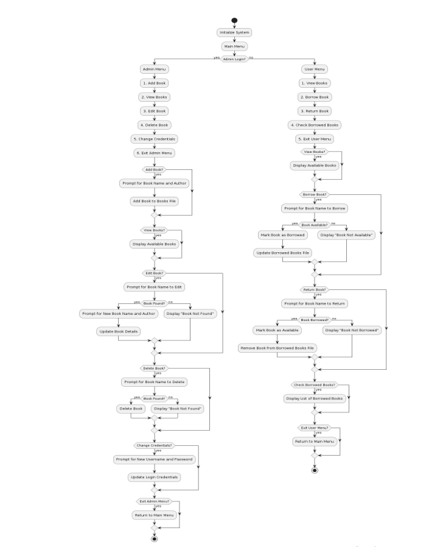

# Library Management System (Bash CLI)

[](https://www.gnu.org/software/bash/)
[](https://www.gnu.org/)
[](LICENSE)

A lightweight, terminal-driven library management system built with pure Bash and POSIX utilities (`grep`, `sed`, `cut`). It features role-based access for administrators and patrons, using persistent flat-file storage without requiring external database dependencies.

Originally developed for the **Operating Systems Sessional (CSE-336)** at **Chittagong University of Engineering & Technology (CUET)**.

---

## System Workflow



---

## Quickstart (Run in 30 Seconds)

### Prerequisites
- Any Unix-like shell: Linux, macOS, WSL, or Git Bash on Windows.
- Standard core utilities: `bash`, `sed`, `grep`, `date`.

### Run

```bash
# 1. Clone repository
git clone https://github.com/RifatHossaiN47/bash-library-management-system.git
cd bash-library-management-system

# 2. Make executable
chmod +x Library_Management.sh

# 3. Launch
./Library_Management.sh
```

> **Default Admin Credentials**:
> - Username: `admin`
> - Password: `admin`
> *(Credentials can be updated directly from the Admin menu)*

---

## Features

### 👤 User (Patron)
- **Browse Catalog**: Inspect all available titles and authors.
- **Borrow Books**: Check out available books; automatically updates the catalog status and stamps the borrow date.
- **Return Books**: Return borrowed titles; restores book status to available and clears the borrow record.
- **View Borrowed List**: See personal borrowed items along with the checkout date (`YYYY-MM-DD`).

### 🛡️ Administrator
- **Password-Protected Access**: Secure login prompt using hidden password input (`read -sp`).
- **Inventory Management**: Add new books, edit existing titles/authors, or remove deleted inventory.
- **Credential Management**: Update the administrative username and password in-place.
- **Automated Provisioning**: The script checks and automatically initializes missing data files on first run.

---

## Data Storage & Architecture

This project uses flat text files to maintain data persistence across sessions:

| File | Format | Purpose |
| :--- | :--- | :--- |
| `books.txt` | `Title by Author, Status` | Master book inventory and availability (`Available` / `Borrowed`) |
| `borrowed_books.txt` | `Title, YYYY-MM-DD` | Active borrowing logs with checkout timestamps |
| `login.txt` | `username:password` | Administrative credentials |

All record operations are executed natively using stream editors (`sed`) and pattern matchers (`grep`) for fast, zero-dependency processing.

---

## Repository Structure

```text
bash-library-management-system/
├── Library_Management.sh        # Core application script
├── books.txt                    # Book inventory dataset
├── borrowed_books.txt           # Active borrow ledger
├── login.txt                    # Stored administrator credentials
├── flowchart_diagram.png        # Architecture & execution flow diagram
├── LibraryManagement_Report.pdf  # Comprehensive academic project report
├── LICENSE                      # MIT License
└── README.md                    # Project documentation
```

---

## Engineering Notes & Trade-offs

- **Why Bash & Flat Files?**
  Built as an operating systems coursework project to explore process control, user I/O, POSIX file streams, and stream parsing without heavy database engines.
- **Security Context**:
  Credentials in `login.txt` are stored as plain text for demonstration simplicity. In a production Linux environment, this should be hardened with hashed storage (e.g., `openssl passwd -6` or `sha256sum`) and restricted file permissions (`chmod 600 login.txt`).

---

## Documentation

For implementation specifications, state transitions, and evaluation details, see the full academic report:
- [Library Management Project Report (PDF)](LibraryManagement_Report.pdf)

---

## License

Distributed under the [MIT License](LICENSE).
